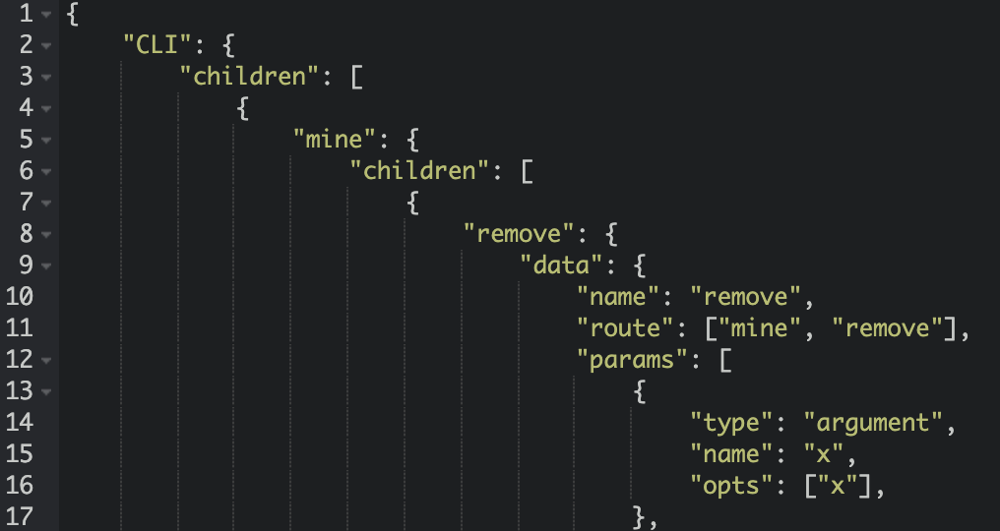
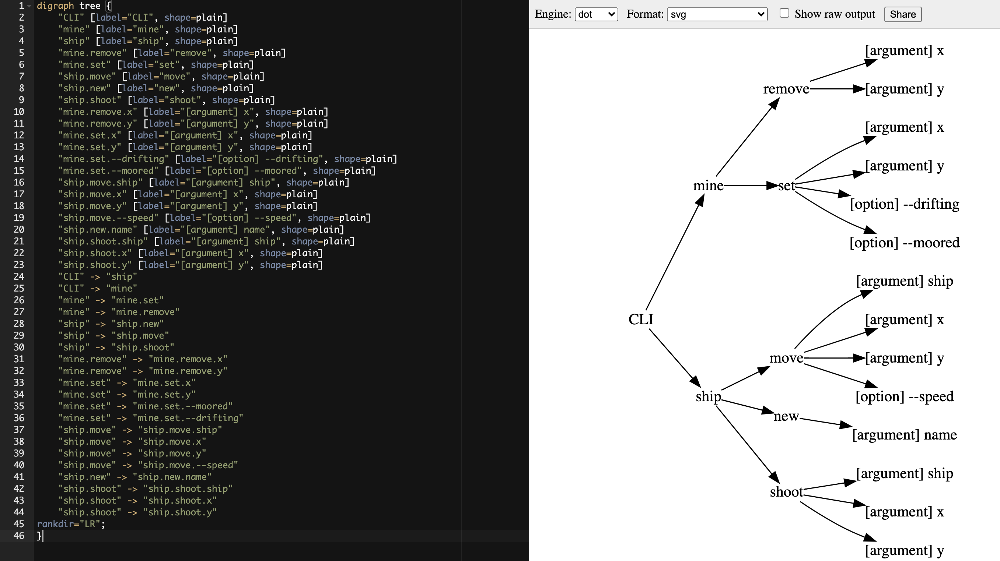
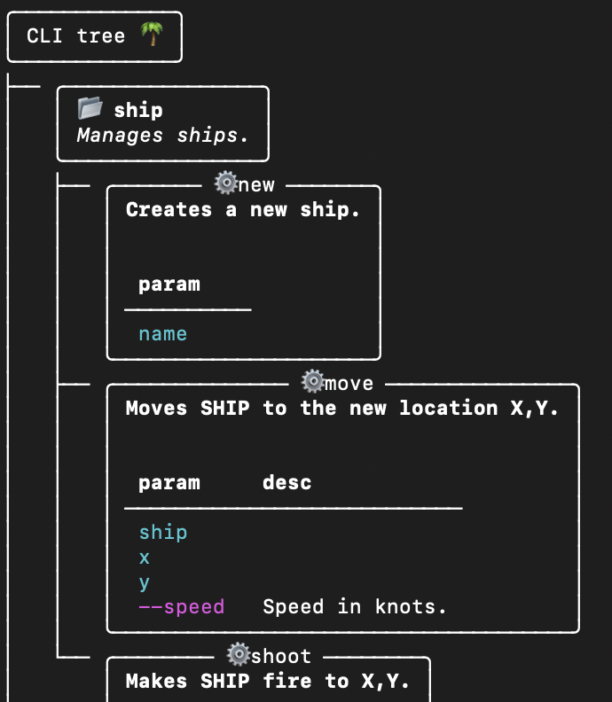

# Click CLI tree visualiser

[](https://github.com/datajoely/click-tree-viz/actions/workflows/ci.yml)

## About this project

[Click](https://click.palletsprojects.com/en/7.x/) is a wonderful library for creating command line interfaces in Python. 
As projects become more complex, tech debt in the form of CLI inconsistency can emerge. 

This library provides maintainers of Click CLI interfaces with the ability to document and visualise the decision tree configured in several formats such as JSON, [GraphViz](https://graphviz.org/) and even a pretty printed [rich](https://github.com/willmcgugan/rich) tree in the terminal.    

## Usage

```python
from click_tree_viz import ClickTreeViz
import battleship # A Click object in your project

ClickTreeViz(battleship.cli).print()
```
This will print the following to the console:
```text
CLI
├── mine
│   ├── remove
│   │   ├── [argument] x
│   │   └── [argument] y
│   └── set
│       ├── [argument] x
│       ├── [argument] y
│       ├── [option] --drifting
│       └── [option] --moored
└── ship
    ├── move
...
```

Render targets available:

| Method      | Description |
| ----------- | ----------- |
| `print()`      | A simple visualisation in the terminal (demonstrated above). |
| `to_dict()`      | Returns a nested Python dictionary: |
| `to_json()`   | Returns a JSON string identical to the Python dictionary.       |
| `to_graph_viz()`   | Returns a `dot` language as a Python string which can be rendered elsewhere: |
| `rich_print()`   | Utilises the [rich](https://github.com/willmcgugan/rich) library to print a visually appealing tree to the terminal: |
|

